# gomacs(1)

## NAME

gomacs - a TTY Emacs clone written in Go

## SYNOPSIS

**gomacs**
[_-Q_]
[_file_ ...]

## DESCRIPTION

**gomacs**
is a terminal-only Emacs-compatible editor.
It supports gap-buffer text storage, unlimited undo, syntax highlighting,
Emacs Lisp configuration, Language Server Protocol (LSP) integration,
and a Dired file manager.

Key bindings follow GNU Emacs conventions.  An Emacs Lisp init file is
loaded at startup from
**~/.gomacs**
or
**~/.config/gomacs/init.el**
(whichever is found first).

## OPTIONS


**-Q**  
Skip loading the init file.


## KEY BINDINGS


### Movement

| | |
|---|---|
| C-f / C-b | Forward / backward character |
| C-n / C-p | Next / previous line |
| M-f / M-b | Forward / backward word |
| C-a / C-e | Beginning / end of line |
| M-< / M-> | Beginning / end of buffer |
| C-v / M-v | Scroll down / up |
| M-g g | Go to line |
| C-x = | What cursor position (line, col, char) |


### Editing

| | |
|---|---|
| C-d | Delete character forward |
| DEL | Delete character backward |
| M-d | Kill word forward |
| M-DEL | Kill word backward |
| C-k | Kill to end of line |
| C-w | Kill region |
| M-w | Copy region |
| C-y | Yank (paste) |
| M-y | Yank pop (cycle kill ring) |
| C-/ | Undo |
| C-x C-u / C-x C-l | Upcase / downcase region |
| M-q | Fill paragraph |
| M-t | Transpose words |
| M-^ | Join line |
| M-m | Back to indentation |
| C-x C-o | Delete blank lines |
| TAB | Indent line / complete |
| C-M-\ | Indent region |
| C-x TAB | Indent rigidly |


### Search and Replace

| | |
|---|---|
| C-s | Incremental search forward (case-insensitive by default) |
| C-r | Incremental search backward (case-insensitive by default) |
| M-% | Query replace |
| M-x replace-string | Replace string (no prompting) |


### Mark and Region

| | |
|---|---|
| C-SPC | Set mark |
| C-x h | Mark whole buffer |
| M-@ | Mark word |
| C-x n n | Narrow to region |
| C-x n w | Widen |


### Windows and Buffers

| | |
|---|---|
| C-x 2 | Split window below |
| C-x 3 | Split window right |
| C-x o | Other window |
| C-x 1 | Delete other windows |
| C-x b | Switch buffer (tab-completion of open buffers) |
| C-x k | Kill buffer |
| C-x C-f | Find (open) file |
| C-x C-s | Save buffer |
| C-x C-w | Write file (save as) |


### Registers

| | |
|---|---|
| C-x r SPC | Save point to register |
| C-x r j | Jump to register |
| C-x r s | Copy region to register |
| C-x r i | Insert register contents |


### Keyboard Macros

| | |
|---|---|
| C-x ( | Start recording macro |
| C-x ) | Stop recording macro |
| C-x e | Execute last macro |


### Version Control (C-x v prefix)

| | |
|---|---|
| C-x v l | Show git log (vc-print-log) |
| C-x v = | Show uncommitted diff (vc-diff) |
| C-x v s | Show repository status (vc-status) |
| C-x v v | Stage file or open commit buffer (vc-next-action) |
| C-x v G | Grep across the repository (vc-grep) |
| C-x v g | Annotate / git blame current file (vc-annotate) |


In vc-log, vc-status, vc-annotate and vc-show buffers:
**q**
returns to the previous buffer,
**d**
or
**RET**
shows a diff,
**l**
shows the commit log message.
**n**
and
**p**
move to the next and previous log entry.
**g**
refreshes the buffer.  In vc-diff/vc-show buffers,
**n/p**
jump between hunks and
**RET**
navigates to the source line.

In a
***vc-commit***
buffer, write a commit message and press
**C-c C-c**
to commit or
**C-c C-k**
to abort.

### Shell

| | |
|---|---|
| M-! | Run shell command |
| M-\| | Shell command on region |


### Text Manipulation

| | |
|---|---|
| M-x sort-lines | Sort lines in region (or whole buffer) |
| M-x delete-duplicate-lines | Remove duplicate lines from region |
| M-x count-words | Count words in buffer or region |
| M-x fill-column | Set fill column |
| C-x l | Count buffer lines (total, before and after point) |


### LSP (Language Server Protocol)

| | |
|---|---|
| M-. | Go to definition |
| M-, | Pop back from definition |
| C-c h | Show hover documentation |


LSP hover documentation is also shown passively in the minibuffer whenever
the cursor rests on a symbol (eldoc-style).

### Navigation

| | |
|---|---|
| C-c , | imenu: jump to function/heading in current buffer (fuzzy completion) |


### Dired (C-x d)

| | |
|---|---|
| n / p | Next / previous file |
| f / e / RET | Open file or directory |
| o | Open in other window |
| d | Mark for deletion |
| u | Unmark |
| x | Execute deletions |
| g | Refresh listing |
| ^ | Go to parent directory |
| q | Quit dired |


### Spell Checking

| | |
|---|---|
| M-x spell | Interactive spell check of current buffer |
| M-$ (M-x ispell-word) | Check spelling of word at point |


During interactive spell check:
**SPC/n**
skips the word,
**1-4**
selects a suggestion by number,
**r**
prompts for a replacement,
**i**
adds the word to the personal dictionary, and
**q**
quits.

### Minibuffer History

The Up and Down arrow keys cycle through previous inputs for each
minibuffer command (e.g.
**vc-grep**,**goto-line**)
when no completion popup is active.

### Major Modes

| | |
|---|---|
| M-x go-mode | Go source |
| M-x python-mode | Python source |
| M-x java-mode | Java source |
| M-x bash-mode | Bash/sh source |
| M-x markdown-mode | Markdown |
| M-x elisp-mode | Emacs Lisp |
| M-x json-mode | JSON |
| M-x yaml-mode | YAML |
| M-x makefile-mode | Makefile |
| M-x text-mode | Plain text (spell checking enabled) |
| M-x fundamental-mode | No syntax or indentation |


Modes are set automatically from the file extension
(.go, .py, .java, .sh/.bash, .md/.markdown, .el, .json, .yaml/.yml, .mk/Makefile).

### Help

| | |
|---|---|
| C-h k | Describe key |
| C-h f | Describe function |
| C-h v | Describe variable |


## CONFIGURATION

Configuration is written in Emacs Lisp and placed in
**~/.gomacs**
or
**~/.config/gomacs/init.el**.


### Configurable variables


**fill-column**  
Target column for
**M-q** (fill-paragraph).
Default: 70.
Example: **(setq fill-column 80)**


**isearch-case-insensitive**  
When non-nil (the default), incremental search (C-s / C-r) is
case-insensitive.  Set to
**nil**
to restore case-sensitive search.
Default: t.
Example: **(setq isearch-case-insensitive nil)**


**go-indent**  
Per-level indentation string for Go buffers.
An integer is expanded to that many spaces; a string is used verbatim.
Default: a tab character.
Example: **(setq go-indent "    ")**


**python-indent**  
Per-level indentation string for Python buffers.
Default: two spaces.
Example: **(setq python-indent 4)**


**sh-indent**  
Per-level indentation string for Bash/sh buffers.
Default: two spaces.
Example: **(setq sh-indent 4)**


**java-indent**  
Per-level indentation string for Java buffers.
Default: two spaces.
Example: **(setq java-indent 4)**


**json-indent**  
Per-level indentation string for JSON buffers.
Default: two spaces.
Example: **(setq json-indent 4)**


**yaml-indent**  
Per-level indentation string for YAML buffers.
Default: two spaces.
Example: **(setq yaml-indent 2)**


**markdown-indent**  
Per-level indentation string for Markdown buffers.
Default: two spaces.
Example: **(setq markdown-indent 4)**


**save-buffer-delete-trailing-whitespace**  
When non-nil (the default), trailing whitespace is deleted automatically
when a buffer is saved.  Set to
**nil**
to disable.
Default: t.
Example: **(setq save-buffer-delete-trailing-whitespace nil)**


**visual-lines**  
When non-nil (the default), lines longer than 80 characters wrap visually;
the file content is unchanged.  Set to
**nil**
to disable wrapping.
Default: t.
Example: **(setq visual-lines nil)**


**spell-command**  
Path to the spell-checker executable.  Set to an empty string to disable
spell checking.
Default: "aspell".
Example: **(setq spell-command "/usr/bin/aspell")**


**spell-language**  
Language code passed to aspell (e.g. "en", "de", "fr").
Default: "en".
Example: **(setq spell-language "de")**


**lsp-completion-min-chars**  
Minimum number of characters typed before LSP auto-completion is triggered.
Default: 1.
Example: **(setq lsp-completion-min-chars 3)**


**screenshot-dir**  
Directory where
**M-x screenshot**
saves PNG files.
If not set, files are saved to the working directory from which gomacs was started.
The directory is created if it does not exist.
Example: **(setq screenshot-dir "~/pictures/screenshots")**


### Key bindings

Custom key bindings can be set in the init file using
**global-set-key**:


```
(global-set-key (kbd "C-c C-c") 'comment-region)
```

### Themes


```
(setq theme 'sweet)       ; select the Sweet theme (default)
(setq theme 'default)     ; plain terminal colours
(load-theme 'sweet)       ; alternative: load theme immediately
```

Individual face colours can be overridden from
**~/.gomacs**
using
**set-face-attribute**:


```
(set-face-attribute 'keyword   :foreground "#e17df3" :bold t)
(set-face-attribute 'string    :foreground "#06c993")
(set-face-attribute 'comment   :foreground "#808693" :italic t)
(set-face-attribute 'modeline  :foreground "#b8c0d4" :background "#292235")
```

Recognised face names:
**default**,**keyword**,**string**,**comment**,**type**,**function**,
**number**,**operator**,**header1**,**header2**,**header3**,
**bold**,**italic**,**code**,**link**,**blockquote**,
**modeline**,**minibuffer**,**region**,**isearch**,**candidate**,**selected**.

Recognised attributes:
**:foreground**,**:background**,**:bold**,**:italic**,**:underline**,**:reverse**.

Custom themes are registered with
**define-gomacs-theme**
and can be loaded with
**setq**
or
**load-theme**:


```
(define-gomacs-theme "my-theme"
  '((keyword  :foreground "#ff0000" :bold t)
    (string   :foreground "#00ff00")
    (default  :foreground "#eeeeee" :background "#1a1a2e")))
(setq theme "my-theme")
```

## FILES


**~/.gomacs**  
Primary Emacs Lisp init file.


**~/.config/gomacs/init.el**  
Alternative init file location (XDG style).


## AUTHORS

Torstein Krause Johansen <torstein@skybert.net>

## VERSION

v1.7.0-6-g7038f0e-dirty

## Screenshots

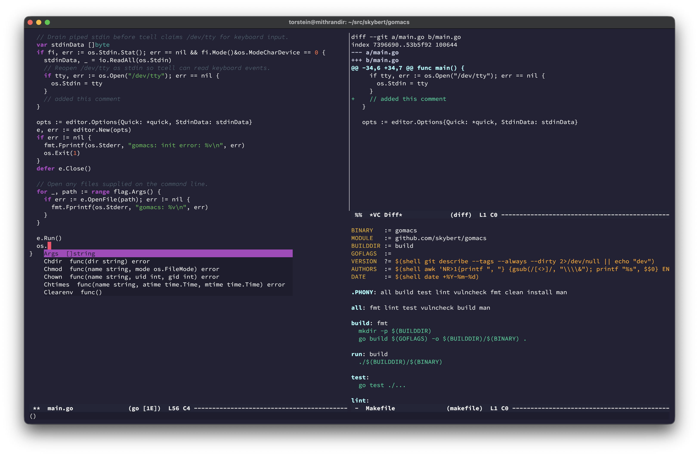

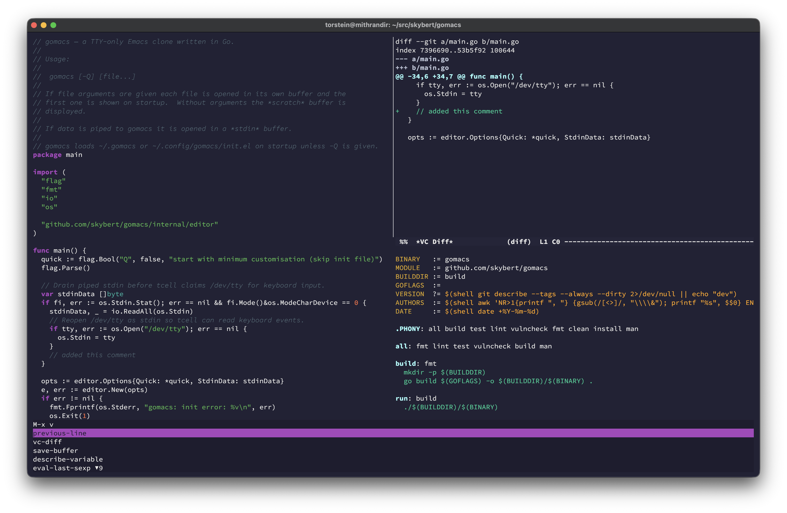

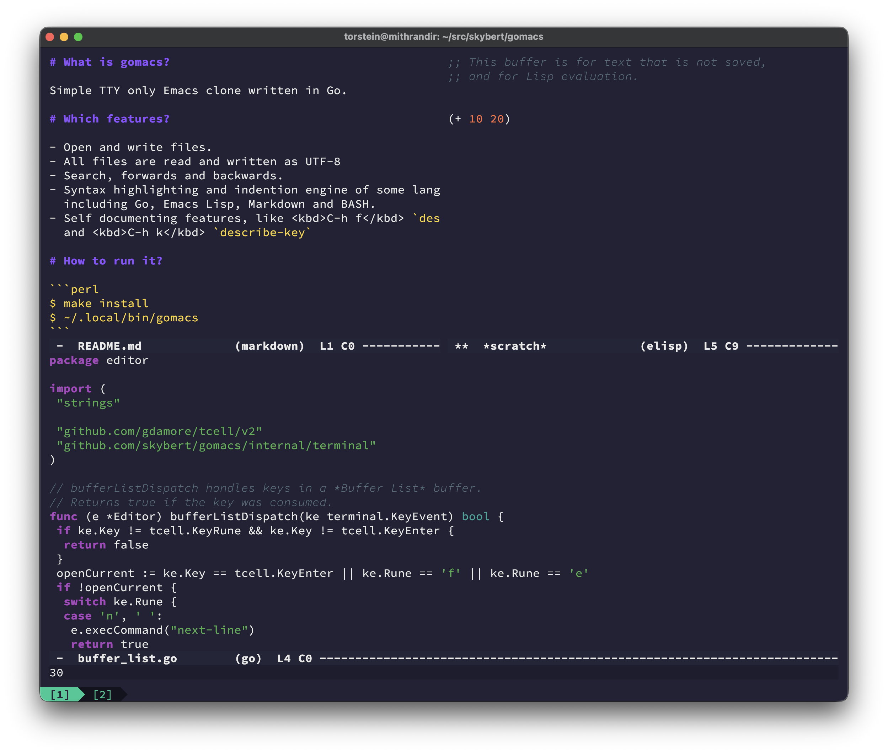


### Android

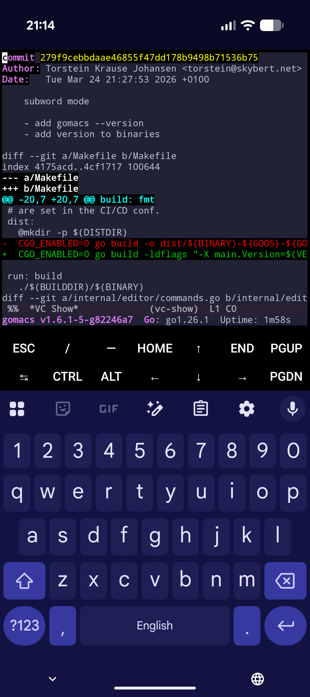

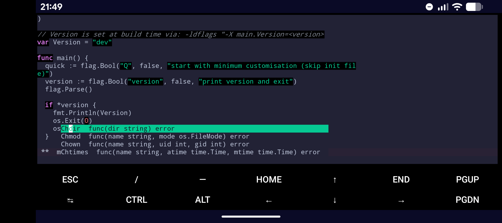

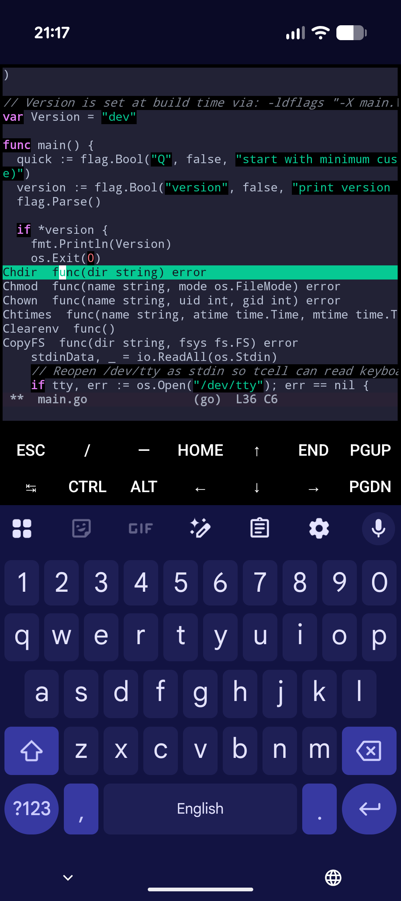

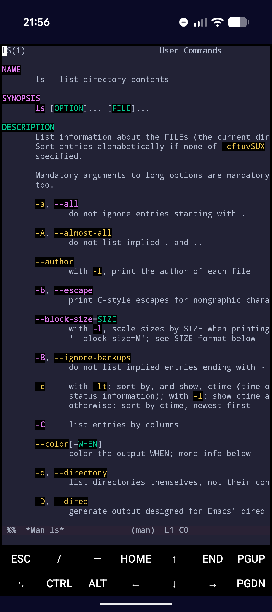

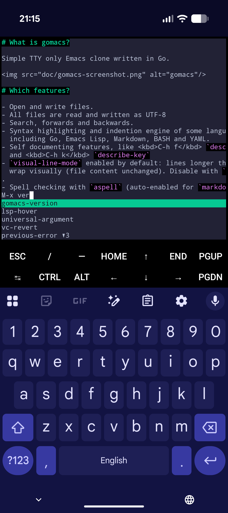

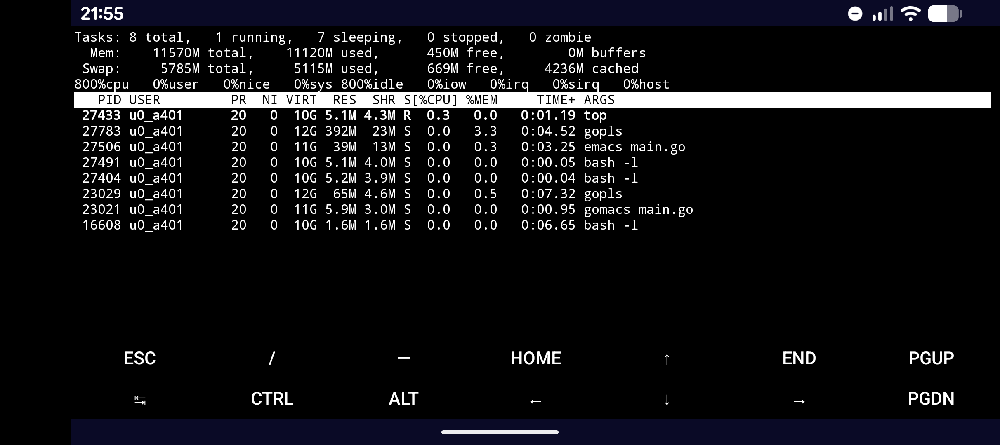


### Darwin

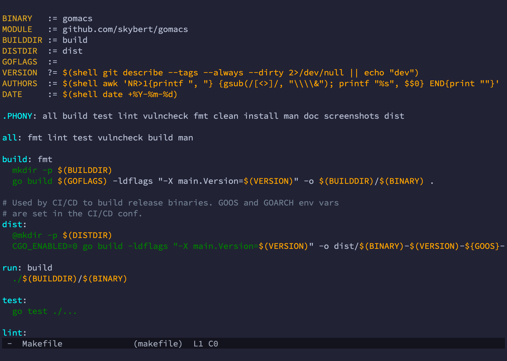

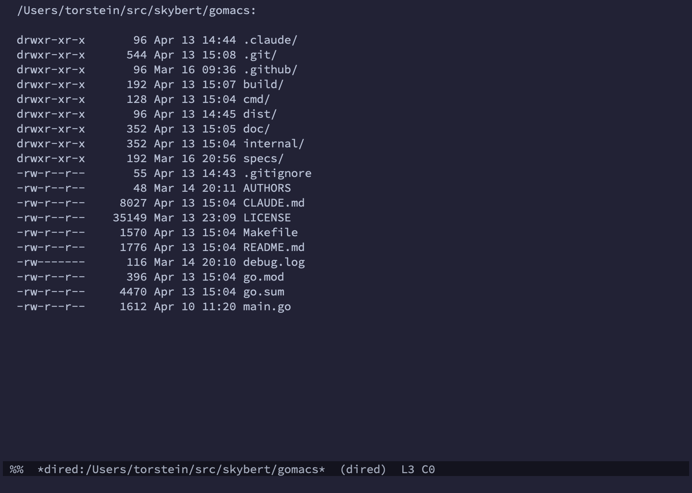

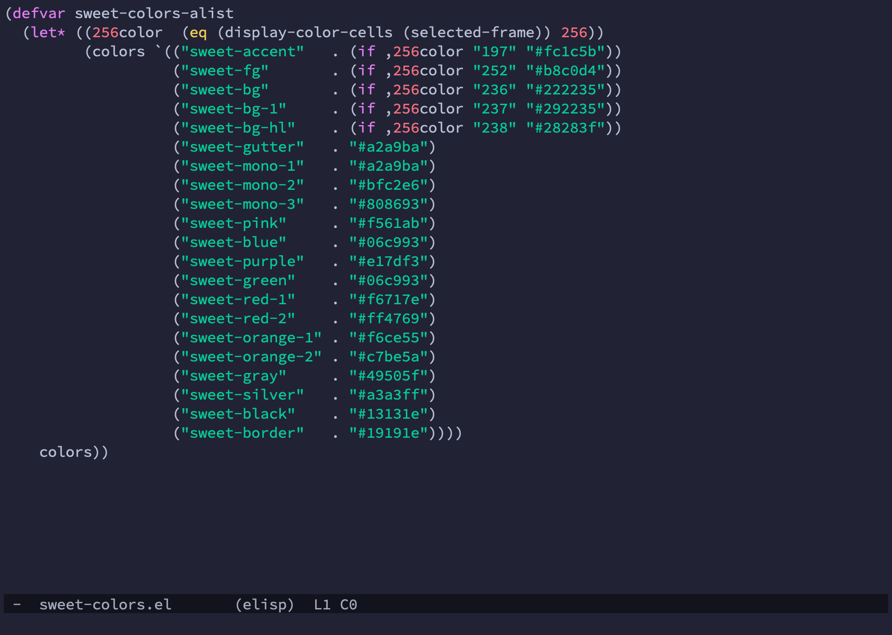

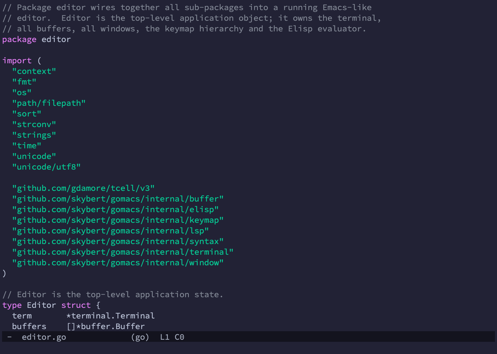

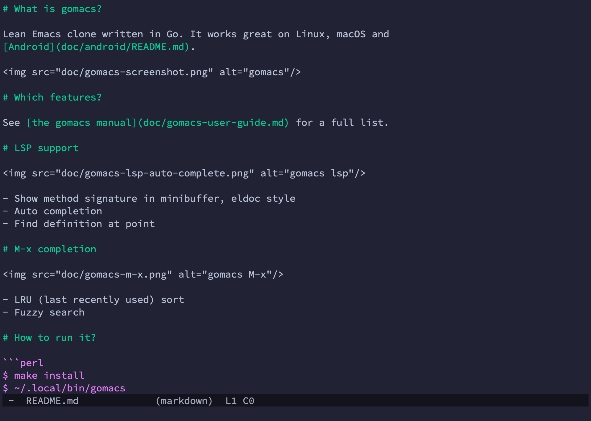

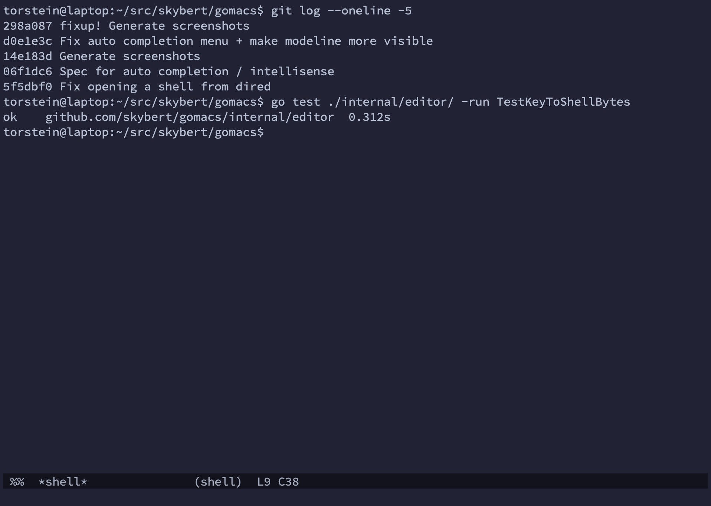

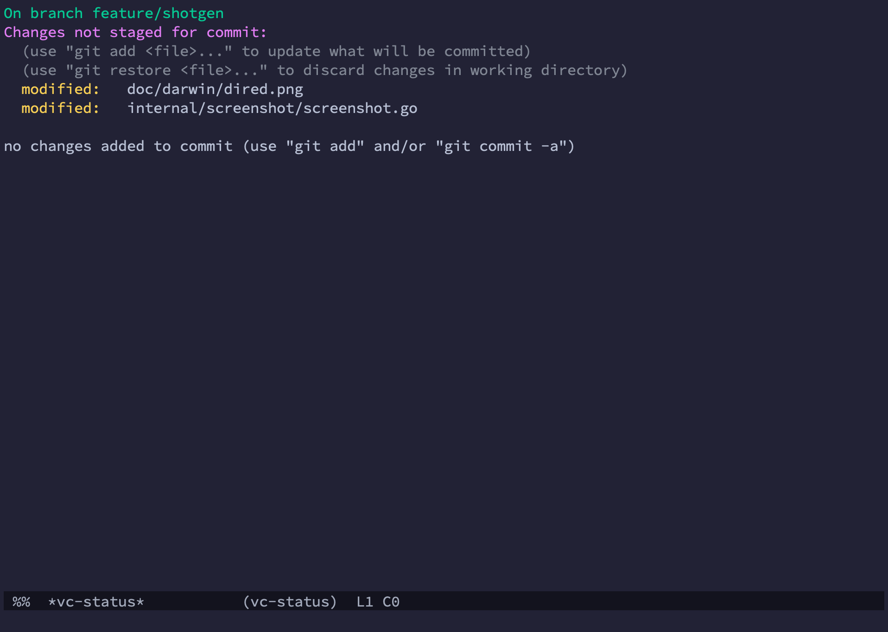

