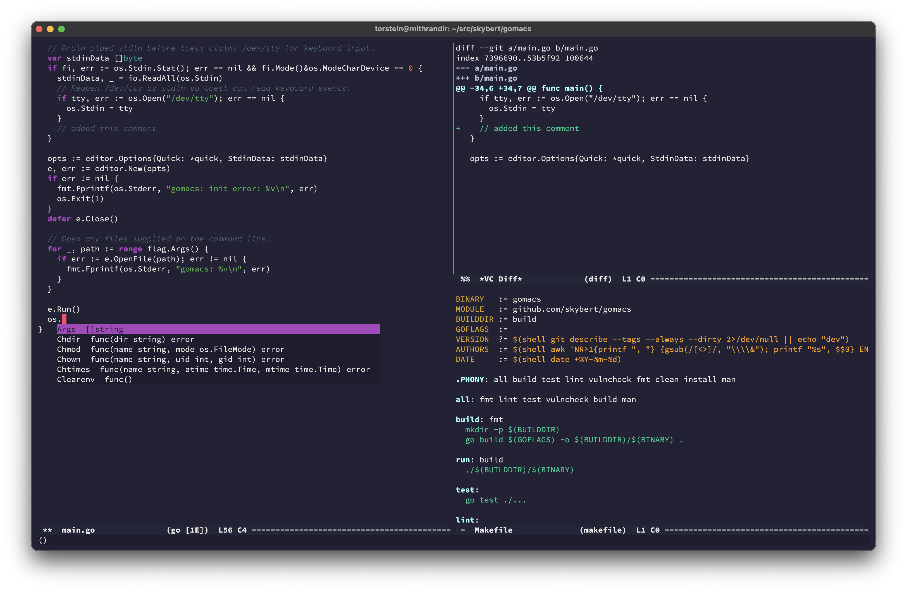
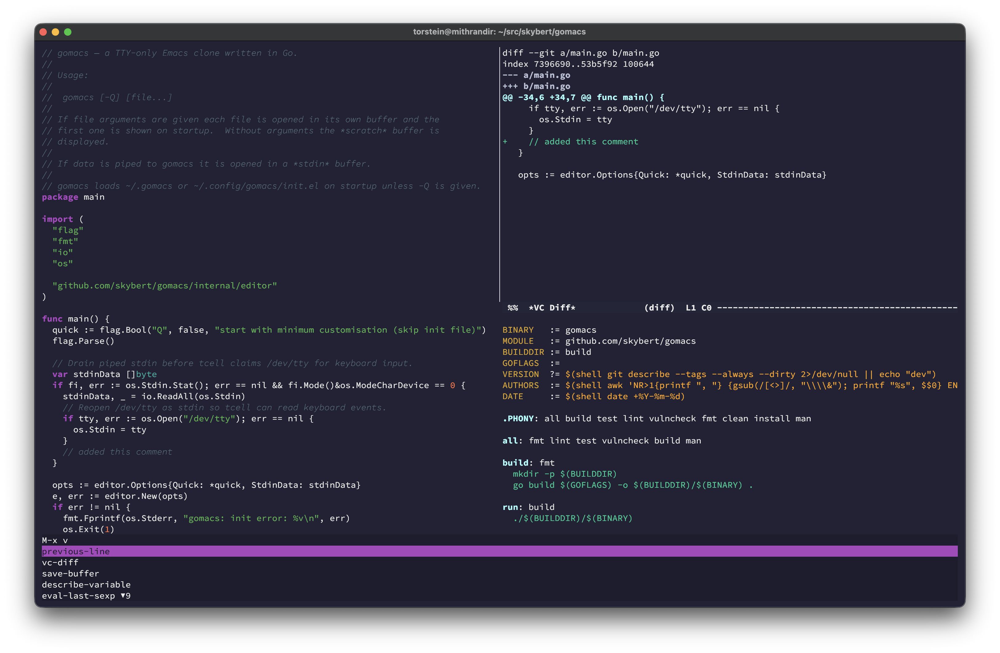
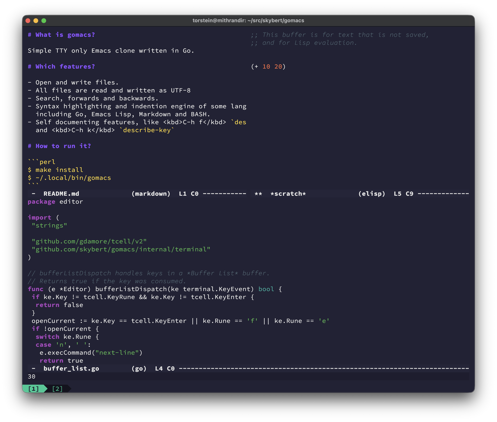

# gomacs(1)

## NAME

gomacs - a TTY Emacs clone written in Go

## SYNOPSIS

**gomacs**
[_-Q_]
[_file_ ...]

## DESCRIPTION

**gomacs**
is a terminal-only Emacs-compatible editor.
It supports gap-buffer text storage, unlimited undo, syntax highlighting,
Emacs Lisp configuration, Language Server Protocol (LSP) integration,
and a Dired file manager.

Key bindings follow GNU Emacs conventions.  An Emacs Lisp init file is
loaded at startup from
**~/.gomacs**
or
**~/.config/gomacs/init.el**
(whichever is found first).

## OPTIONS


**-Q**  
Skip loading the init file.


## KEY BINDINGS


### Movement

| | |
|---|---|
| C-f / C-b | Forward / backward character |
| C-n / C-p | Next / previous line |
| M-f / M-b | Forward / backward word |
| C-a / C-e | Beginning / end of line |
| M-< / M-> | Beginning / end of buffer |
| C-v / M-v | Scroll down / up |
| M-g g | Go to line |
| C-x = | What cursor position (line, col, char) |


### Editing

| | |
|---|---|
| C-d | Delete character forward |
| DEL | Delete character backward |
| M-d | Kill word forward |
| M-DEL | Kill word backward |
| C-k | Kill to end of line |
| C-w | Kill region |
| M-w | Copy region |
| C-y | Yank (paste) |
| M-y | Yank pop (cycle kill ring) |
| C-/ | Undo |
| C-x C-u / C-x C-l | Upcase / downcase region |
| M-q | Fill paragraph |
| M-t | Transpose words |
| M-^ | Join line |
| M-m | Back to indentation |
| C-x C-o | Delete blank lines |
| TAB | Indent line / complete |
| C-M-\ | Indent region |
| C-x TAB | Indent rigidly |


### Search and Replace

| | |
|---|---|
| C-s | Incremental search forward (case-insensitive by default) |
| C-r | Incremental search backward (case-insensitive by default) |
| M-% | Query replace |
| M-x replace-string | Replace string (no prompting) |


During incremental search,
**C-w**
pulls the next word of buffer text (following the current match) into the
search string.  For example, searching for
**Camel**
and landing inside
**CamelCase**
can be extended to
**CamelCase**
with a single
**C-w**;
pressing it again pulls in the following word.  When a search runs off
the end (or beginning) of the buffer it wraps around to the other end
and reports this in the minibuffer, e.g.
**Wrapped isearch (hit bottom of buffer): ...**
or
**Wrapped isearch (hit top of buffer): ...**.

### Mark and Region

| | |
|---|---|
| C-SPC | Set mark |
| C-x h | Mark whole buffer |
| M-@ | Mark word |
| C-x n n | Narrow to region |
| C-x n w | Widen |


### Windows and Buffers

| | |
|---|---|
| C-x 2 | Split window below |
| C-x 3 | Split window right |
| C-x o | Other window |
| C-x 1 | Delete other windows |
| M-o | Jump to a window by its letter (window-jump) |
| C-x b | Switch buffer (tab-completion of open buffers) |
| C-x k | Kill buffer |
| C-x C-f | Find (open) file |
| C-x C-s | Save buffer |
| C-x C-w | Write file (save as) |


**M-o**
labels every visible window with a green home-row letter (from
**asdfghkl**),
suppressing syntax highlighting while the overlay is shown so the
letters stand out.  Press the letter to move point to that window, or
**C-g**
to cancel.

### Registers

| | |
|---|---|
| C-x r SPC | Save point to register |
| C-x r j | Jump to register |
| C-x r s | Copy region to register |
| C-x r i | Insert register contents |


### Keyboard Macros

| | |
|---|---|
| C-x ( | Start recording macro |
| C-x ) | Stop recording macro |
| C-x e | Execute last macro |


### Version Control (C-x v prefix)

| | |
|---|---|
| C-x v l | Show git log (vc-print-log) |
| C-x v = | Show uncommitted diff (vc-diff) |
| C-x v s | Show repository status (vc-status) |
| C-x v v | Stage file or open commit buffer (vc-next-action) |
| C-x v G | Grep across the repository (vc-grep) |
| C-x v g | Annotate / git blame current file (vc-annotate) |


In vc-log, vc-status, vc-annotate and vc-show buffers:
**q**
returns to the previous buffer,
**d**
or
**RET**
shows a diff,
**l**
shows the commit log message.
**n**
and
**p**
move to the next and previous log entry.
**g**
refreshes the buffer.  In vc-diff/vc-show buffers,
**n/p**
jump between hunks and
**RET**
navigates to the source line.

In a
***vc-commit***
buffer, write a commit message and press
**C-c C-c**
to commit or
**C-c C-k**
to abort.

### Project

| | |
|---|---|
| C-x p f | Fuzzy find a file in the current project (project-find-file) |
| C-x p g | Grep the current project (project-grep) |
| C-x p ! | Run the project build (project-build) |


The project root is determined by the current buffer's VC backend
(e.g. the git repository root).
**C-x p f**
lists every file under that root with fuzzy completion in the
minibuffer.
**C-x p g**
prompts for a pattern and searches the project, using the VC backend's
grep when one is available or falling back to
**grep -R -i -n**
otherwise; results are shown in a
***grep***
buffer navigable with
**next-error** (see below).

### Compilation and Errors

| | |
|---|---|
| M-x project-build | Run a build command in the project root, output to *compilation* |
| C-x ` | Visit the next error/match (next-error) |
| M-g n | Visit the next error/match (next-error) |
| M-g p | Visit the previous error/match (previous-error) |


**M-x project-build**
prompts for a build command (defaulting to
**make ,**
or
**mvn clean install**
when the project root contains a
**pom.xml**)
and runs it in the VC root, showing the output in a
***compilation***
buffer.  In that buffer,
**q**
quits,
**g**
reruns the build, and
**n / p**
move to the next/previous error.

**next-error** (**C-x `** or **M-g n**) and **previous-error**
(**M-g p**) step through file/line hits recorded by the most recent
***compilation***, ***grep*** (from **project-grep** or
**vc-grep**), or Gherkin step-definition search.

### Shell

| | |
|---|---|
| M-! | Run shell command |
| M-\| | Shell command on region |
| M-x shell | Open a PTY-backed shell buffer running $SHELL |


**M-x shell** opens a full terminal emulator buffer capable of running
full-screen programs such as **top**, with ANSI escape sequences
interpreted.  The first shell buffer is named ***shell***; a second
invocation creates ***shell/<repo>*** (named after the VC repository, or
the current directory's basename outside a repository) and switches to it
if it already exists.  Inside a shell buffer, **C-SPC**, **C-v**,
**M-v**, **M-w**, **M-x** and the **C-x** prefix (including
**C-x b** and **C-x k**) remain bound to gomacs; all other keys are
sent to the shell.

### Text Manipulation

| | |
|---|---|
| M-x sort-lines | Sort lines in region (or whole buffer) |
| M-x delete-duplicate-lines | Remove duplicate lines from region |
| M-x count-words | Count words in buffer or region |
| M-x fill-column | Set fill column |
| C-x l | Count buffer lines (total, before and after point) |


### LSP (Language Server Protocol)

| | |
|---|---|
| M-. | Go to definition |
| M-, | Pop back from definition |
| M-? | Find references (lsp-find-references) |
| C-c h | Show hover documentation |


LSP hover documentation is also shown passively in the minibuffer whenever
the cursor rests on a symbol (eldoc-style).

### Navigation

| | |
|---|---|
| C-c , | imenu: jump to function/heading in current buffer (fuzzy completion) |


### Dired (C-x d)

| | |
|---|---|
| n / p | Next / previous file |
| f / e / RET | Open file or directory |
| o | Open in other window |
| d | Mark for deletion |
| u | Unmark |
| x | Execute deletions |
| g | Refresh listing |
| ^ | Go to parent directory |
| q | Quit dired |


### Debugger (C-c d prefix)

| | |
|---|---|
| C-c d b | Toggle breakpoint at the current line (debug-toggle-breakpoint) |
| C-c d d | Start a debug session (debug-start) |
| C-c d c | Continue execution (debug-continue) |
| C-c d n | Step to the next line (debug-step-next) |
| C-c d i | Step into the current call (debug-step-in) |
| C-c d o | Step out of the current function (debug-step-out) |
| C-c d e | Evaluate the expression at point or region (debug-eval) |
| C-c d q | Exit the debug session (debug-exit) |


While a debug session is active, **n**, **i**, **o**, **c**, **e**
and **q** also work as single-letter shortcuts (without the
**C-c d**
prefix) when the active buffer is a source file.  To make that unambiguous,
every source buffer is read-only for the duration of the session, including
files opened after it started; each buffer's original state is restored by
**debug-exit**.
**debug-start**
inspects the current context (test file, main program, or server) to
decide how to launch the program.  Breakpoints are shown in a gutter
in the left margin of the source buffer; while stopped, the
***Debug Locals***, ***Debug Stack*** and ***Debug REPL***
buffers show local variables, the call stack, and an evaluation
prompt.

Go buffers are debugged with
**dlv**,
which must be on
**PATH**.
Java buffers are debugged through the running jdtls language server, which
must have been started with the java-debug plugin; see
**java-lsp-command**
under
**CONFIGURATION**
below.

### Spell Checking

| | |
|---|---|
| M-x spell | Interactive spell check of current buffer |
| M-x ispell-buffer | Interactive spell check of current buffer (same as spell) |
| M-$ (M-x ispell-word) | Check spelling of word at point |


During interactive spell check:
**SPC/n**
skips the word,
**1-4**
selects a suggestion by number,
**r**
prompts for a replacement,
**i**
adds the word to the personal dictionary, and
**q**
quits.

### Minibuffer History

The Up and Down arrow keys cycle through previous inputs for each
minibuffer command (e.g.
**vc-grep**,**goto-line**)
when no completion popup is active.

### Major Modes

| | |
|---|---|
| M-x go-mode | Go source |
| M-x python-mode | Python source |
| M-x java-mode | Java source |
| M-x bash-mode | Bash/sh source |
| M-x markdown-mode | Markdown |
| M-x elisp-mode | Emacs Lisp |
| M-x json-mode | JSON |
| M-x yaml-mode | YAML |
| M-x makefile-mode | Makefile |
| M-x gherkin-mode | Gherkin (.feature) |
| M-x text-mode | Plain text (spell checking enabled) |
| M-x fundamental-mode | No syntax or indentation |


Modes are set automatically from the file extension
(.go, .py, .java, .sh/.bash, .md/.markdown, .el, .json, .yaml/.yml, .mk/Makefile, .feature).

In Gherkin buffers,
**M-.**
on a step line (e.g.
**Given user logs in**)
converts the step to a CamelCase identifier and searches the project
for a matching Go/gocuke function or Java
**@Given/@When/@Then**
annotation, jumping there directly on a single match.
**M-,**
pops back.  Multiple matches are listed in a grep buffer navigable
with
**next-error**.

### Help

| | |
|---|---|
| C-h k | Describe key |
| C-h f | Describe function |
| C-h v | Describe variable |


## CONFIGURATION

Configuration is written in Emacs Lisp and placed in
**~/.gomacs**
or
**~/.config/gomacs/init.el**.


### Configurable variables


**fill-column**  
Target column for
**M-q** (fill-paragraph).
Default: 70.
Example: **(setq fill-column 80)**


**isearch-case-insensitive**  
When non-nil (the default), incremental search (C-s / C-r) is
case-insensitive.  Set to
**nil**
to restore case-sensitive search.
Default: t.
Example: **(setq isearch-case-insensitive nil)**


**auto-revert**  
When non-nil (the default), an unmodified buffer is reloaded when its file
changes on disk.
Default: t.
Example: **(setq auto-revert nil)**


**subword-mode**  
When non-nil (the default), word motion stops at the sub-words of a
CamelCase identifier.
Default: t.
Example: **(setq subword-mode nil)**


**go-indent**  
Per-level indentation string for Go buffers.
An integer is expanded to that many spaces; a string is used verbatim.
Default: a tab character.
Example: **(setq go-indent "    ")**


**python-indent**  
Per-level indentation string for Python buffers.
Default: two spaces.
Example: **(setq python-indent 4)**


**sh-indent**  
Per-level indentation string for Bash/sh buffers.
Default: two spaces.
Example: **(setq sh-indent 4)**


**java-indent**  
Per-level indentation string for Java buffers.
Default: two spaces.
Example: **(setq java-indent 4)**


**json-indent**  
Per-level indentation string for JSON buffers.
Default: two spaces.
Example: **(setq json-indent 4)**


**perl-indent**  
Per-level indentation string for Perl buffers.
Default: two spaces.
Example: **(setq perl-indent 4)**


Go, Python, Bash, Java, JSON and Perl are the modes with an indentation engine
of their own, and so the only ones with a per-level indent unit to configure.
Every other mode (Markdown, YAML, Makefile, Gherkin, Text, Fundamental) indents
a new line to match the previous one, and Emacs Lisp indents relative to the
enclosing form; none of them takes an indent unit.

**go-lsp-command**  
Command, with optional arguments, that starts the language server for Go
buffers.  Set to the empty string to disable the server.
Default: "gopls".
Example: **(setq go-lsp-command "gopls -remote=auto")**


**java-lsp-command**  
Command, with optional arguments, that starts the language server for Java
buffers.  This is also how
**debug-start**
reaches the Java debug adapter, which jdtls provides through the java-debug
plugin, so point this at a jdtls launcher started with that plugin in its
initializationOptions.bundles.
Set to the empty string to disable the server.
Default: "jdtls".
Example: **(setq java-lsp-command "jdtls -data /tmp/jdtls-ws")**


The same
**<mode>-lsp-command**
pattern works for every major mode, so a mode that ships without a language
server can be given one, for example **(setq python-lsp-command "pylsp")**.

**save-buffer-delete-trailing-whitespace**  
When non-nil (the default), trailing whitespace is deleted automatically
when a buffer is saved.  Set to
**nil**
to disable.
Default: t.
Example: **(setq save-buffer-delete-trailing-whitespace nil)**


**delete-trailing-whitespace**  
Shorter alias of
**save-buffer-delete-trailing-whitespace**.
Default: t.
Example: **(setq delete-trailing-whitespace nil)**


**visual-lines**  
When non-nil (the default), lines longer than 80 characters wrap visually;
the file content is unchanged.  Set to
**nil**
to disable wrapping.
Default: t.
Example: **(setq visual-lines nil)**


**spell-command**  
Path to the spell-checker executable.  Set to an empty string to disable
spell checking.
Default: "aspell".
Example: **(setq spell-command "/usr/bin/aspell")**


**spell-language**  
Language code passed to aspell (e.g. "en", "de", "fr").
Default: "en".
Example: **(setq spell-language "de")**


**completion-menu-trigger-chars**  
Minimum number of characters typed before the auto-completion menu appears.
Default: 3.
Example: **(setq completion-menu-trigger-chars 1)**


**lsp-completion-min-chars**  
Deprecated alias of
**completion-menu-trigger-chars**.
Default: 3.
Example: **(setq lsp-completion-min-chars 1)**


**debug-locals-auto-expand-depth**  
Number of struct levels to auto-expand in the
***Debug Locals***
panel when the debugger stops.
Default: 1.
Example: **(setq debug-locals-auto-expand-depth 2)**


**theme**  
Name of the colour theme.  See
**Themes**
below for the available names and for face overrides.
Default: "sweet".
Example: **(setq theme 'default)**


### Key bindings

Custom key bindings can be set in the init file using
**global-set-key**:


```
(global-set-key (kbd "C-c C-c") 'comment-region)
```

### Themes


```
(setq theme 'sweet)       ; select the Sweet theme (default)
(setq theme 'default)     ; plain terminal colours
(load-theme 'sweet)       ; alternative: load theme immediately
```

Individual face colours can be overridden from
**~/.gomacs**
using
**set-face-attribute**:


```
(set-face-attribute 'keyword   :foreground "#e17df3" :bold t)
(set-face-attribute 'string    :foreground "#06c993")
(set-face-attribute 'comment   :foreground "#808693" :italic t)
(set-face-attribute 'modeline  :foreground "#b8c0d4" :background "#292235")
```

Recognised face names:
**default**,**keyword**,**string**,**comment**,**type**,**function**,
**number**,**operator**,**header1**,**header2**,**header3**,
**bold**,**italic**,**code**,**link**,**blockquote**,
**modeline**,**minibuffer**,**region**,**isearch**,**candidate**,**selected**.

Recognised attributes:
**:foreground**,**:background**,**:bold**,**:italic**,**:underline**,**:reverse**.

Custom themes are registered with
**define-gomacs-theme**
and can be loaded with
**setq**
or
**load-theme**:


```
(define-gomacs-theme "my-theme"
  '((keyword  :foreground "#ff0000" :bold t)
    (string   :foreground "#00ff00")
    (default  :foreground "#eeeeee" :background "#1a1a2e")))
(setq theme "my-theme")
```

## FILES


**~/.gomacs**  
Primary Emacs Lisp init file.


**~/.config/gomacs/init.el**  
Alternative init file location (XDG style).


## AUTHORS

Torstein Krause Johansen <torstein@skybert.net>

## VERSION

v2.0.0-dirty

## Screenshots







